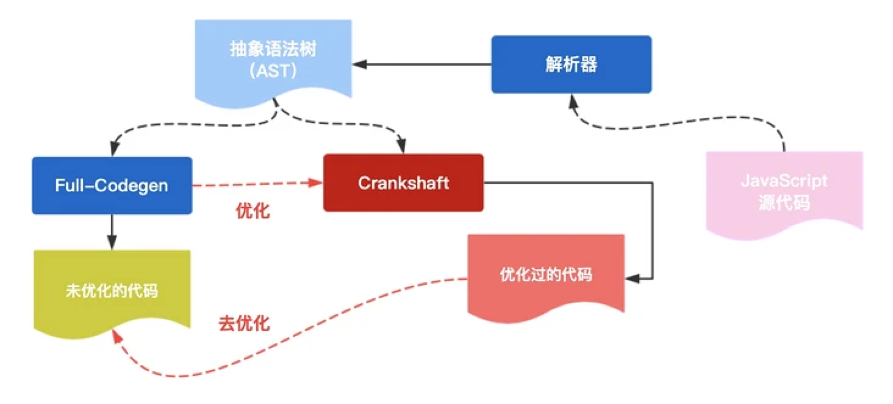

<!--
 * @Author: your name
 * @Date: 2021-10-27 16:41:34
 * @LastEditTime: 2021-10-27 17:03:50
 * @LastEditors: Please set LastEditors
 * @Description: In User Settings Edit
 * @FilePath: /matias-v8/README.md
-->
# matias-v8

V8 引擎学习

## V8 的重要部件

* Ignition（基线编译器）
* TurboFan（优化编译器）
* Orinoco（垃圾回收器）
* Liftoff（Liftoff 是从 V8 6.8 开始启用的针对 WebAssembly 的基线编译器。）

## JIT

“优化”（optimization）
“去优化”（Deoptimization）

## 垃圾回收

当内存不再需要的时候，会被周期性运行的垃圾回收器回收。

任何垃圾回收器都有一些必须定期完成的基本任务。

* 确定存活/死亡对象
* 回收/再利用死亡对象所占用的内存
* 压缩/整理内存（可选）
V8 的垃圾回收主要有三个阶段：标记、清除和整理。

V8 在新生代和老生代采用了不同的垃圾回收策略，使垃圾回收更有针对性、更加高效。同时，V8 对新生代和老生代的内存大小也进行了限制。

名称	算法	大小
新生代	Parallel Scavenge 算法	32MB（64位）/ 16MB（32位）
老生代	标记清除、标记整理算法	1400MB（64位）/ 700MB（32 位）

### 新生代
V8 使用 Parallel Scavenge（并行清理）算法，它与 Halstead 算法类似（在 V8 v6.2 版本之前使用的是类 Cheney 算法），其核心是复制算法。

复制算法是一种以空间换时间的方式。

V8 将新生代拆分为大小相同的两个半空间，分别称为 Form 空间 和 To 空间。垃圾回收时，V8 会检查 From 空间中的存活对象，将这些对象复制到 To 空间。之后，V8 将直接释放死亡对象所对应的空间。每次完成复制后，From 和 To 的位置将发生互换。

当一个对象经过一次复制依然存活，该对象将被移动到老生代，这个过程称为晋升。

### 老生代
根据世代假说，老生代的对象倾向于永生，即它们很少需要被回收，这意味着在老生代使用复制算法是不可行的。V8 在老生代中使用了标记清除和标记整理算法进行垃圾回收。

#### 标记清除（Mark-Sweep）

标记清除已经诞生了半个多世纪。它的算法原理十分简单。垃圾回收器从根节点开始，标记根直接引用的对象，然后递归标记这些对象的直接引用对象。对象的可达性作为是否“存活”的依据。

标记清除算法所花费的时间与活动对象的数量成正比。

#### 标记整理（Mark-Compact）
标记整理算法是将复制算法和标记清除算法结合的产物。

当我们进行标记清除之后，就可能会产生内存碎片，这些碎片对我们程序进行内存分配时不利的。

举个极端的例子，在下图中，蓝色的对象是需要我们分配内存的新对象，在内存整理之前，所有的碎片空间都无法容纳完整的对象，而在内存整理之后，碎片空间被合并成一个大的空间，也能容纳下新对象。

标记整理算法的优缺点都十分明显。它的优点是，能够让堆利用更加充分有效。它的缺点是，它需要额外的扫描时间和对象移动时间，并且花费的时间与堆的大小成正比。

### 最大保留空间 —— 一个社区流传已久的 “错误”
V8 会在堆内存中为新老生代预留空间，引申出一个最大保留空间（Max Reserved）的概念。影响最大保留空间大小的因素主要有 `max_old_generation_size_`（老生代最大空间）和 `max_semi_space_size_`（新生代最大半空间）。其中，前者在 Node 中可以通过 `--max-old-space-size` 指定。

社区中流传已久的计算方式是 “最大保留空间 = 4 * 新生代最大半空间 + 老生代最大空间”，其源头应该是来自朴灵老师的《深入浅出 Node.js》。但从这本书出版后（2013 年 12 月）到现在，最大保留空间的计算方式实际上进行了两次调整。

5.1.277 及之前版本（《深入浅出 Node.js》对应的版本）

// Returns the maximum amount of memory reserved for the heap.  For
// the young generation, we reserve 4 times the amount needed for a
// semi space.  The young generation consists of two semi spaces and
// we reserve twice the amount needed for those in order to ensure
// that new space can be aligned to its size.
intptr_t MaxReserved() {
  return 4 * reserved_semispace_size_ + max_old_generation_size_;
}
5.1.278 版本

// Returns the maximum amount of memory reserved for the heap.
intptr_t MaxReserved() {
  return 2 * max_semi_space_size_ + max_old_generation_size_;
}
7.4.137 版本

size_t Heap::MaxReserved() {
  const size_t kMaxNewLargeObjectSpaceSize = max_semi_space_size_;
  return static_cast<size_t>(2 * max_semi_space_size_ +
                             kMaxNewLargeObjectSpaceSize +
                             max_old_generation_size_);
}
简单来说，这两次调整在数值上是将 “新生代最大半空间” 的系数从 4 倍变为 2 倍再变为 3 倍。

根据 Node.js 的 Release 记录，以上 V8 版本与 Node.js 版本的对应关系为：

V8 版本	Node.js 版本
5.1.277 及之前版本	6.4.0 及之前版本
5.1.278 - 7.4.136	6.4.0 之后，12.0.0 之前版本
7.4.137 及之后版本	12.0.0 及之后版本
考虑到 Node.js 6.4.0 版本发布时间较早，为 2016 年 8 月，目前 LTS 版本也不再维护，可以合理地推断目前使用比例较大的计算方式为第二种和第三种。然而，社区中的资料鲜有提及这两次变更的（本人只找到一篇知乎专栏里提到了第二种计算方式），与此同时仍有很多新发布的文章仍然使用第一种计算方式而没有注明 Node.js 版本，容易让读者认为最大保留空间计算方式没有发生变化，大量过时的信息显然已经造成了 “错误”。

### 代码缓存
在 Chrome 浏览器中有很多功能都或多或少影响了 JavaScript 的执行过程，其中一个功能是代码缓存（Code Caching）。

在用户访问相同的页面，并且该页面关联的脚本文件没有任何改动的情况下，代码缓存技术会让 JavaScript 的加载和执行变得更快。

代码缓存被分为 cold、warm、hot 三个等级。

用户首次请求 JS 文件时（即 cold run），Chrome 将下载该文件并将其提供给 V8 进行编译，并将该文件缓存到磁盘中。
当用户第二次请求这个 JS 文件时（即 warm run），Chrome 将从浏览器缓存中获取该文件，并将其再次交给 V8 进行编译。在 warm run 阶段编译完成后，编译的代码会被反序列化，作为元数据附加到缓存的脚本文件中。
当用户第三次请求这个 JS 文件时（即 hot run），Chrome 从缓存中获取文件和元数据，并将两者交给 V8。V8 将跳过编译阶段，直接反序列化元数据。
## 参考

[v8](https://segmentfault.com/a/1190000020944278)
[V8 博客](https://v8.dev/blog/code-caching-for-devs)